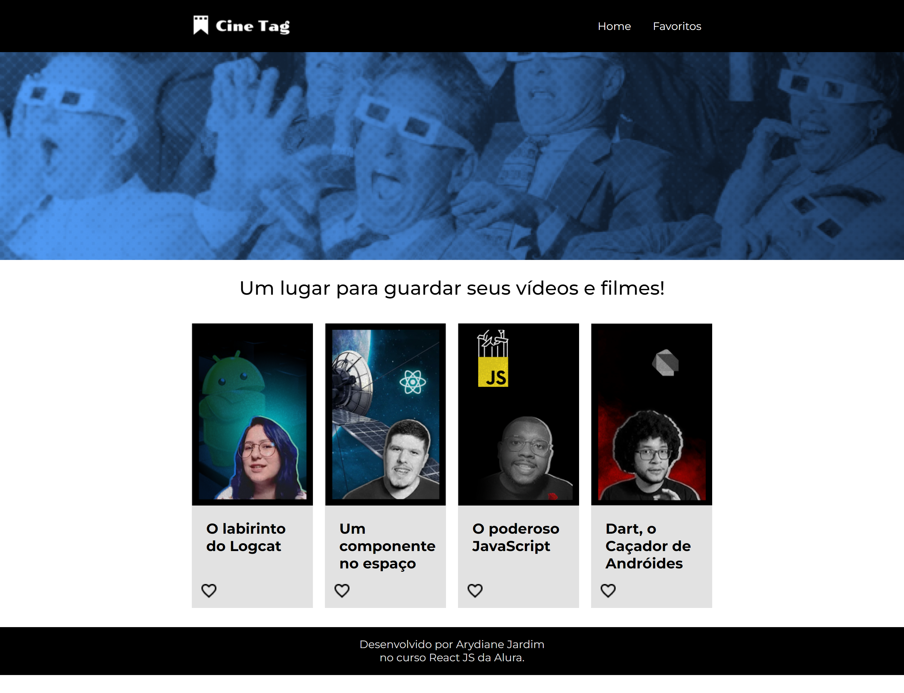

# Projeto Cine Tag

 O projeto Cine Tag é uma plataforma de compartilhamento de filmes e possibilita a ação tanto de assistir quanto de favoritar um item. Foi desenvolvido no curso "React: praticando React com Js" da Alura.

<strong>O objetivo do projeto é praticar os seguintes conceitos:</strong> 

- Construção de componentes e páginas
- Implementação de rotas normais, dinâmicas e aninhadas
- Aplicação dos hooks useState, useParams, useEffect e useContext
- Uso de contextos do React
- Consumo de uma API

## 💻 Layout  

### Web

  

 ## 🔧 Tecnologias 

As tecnologias usadas foram: 
* React
* JavaScript
* CSS module

## 🛠️ Abrir e rodar o projeto
Para abrir e rodar o projeto, execute npm i para instalar as dependências e npm start para inicar o projeto.

Depois, acesse http://localhost:3000/ no seu navegador.
